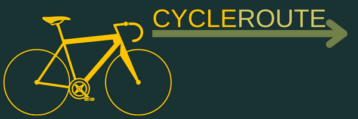

# CycleRoute


## Table of Contents
<ul>
<li>Description</li>
<li>Technologies Used</li>
<li>APIs</li>
<li>Installation</li>
<li>Testing</li>
<li>Future Development</li>
</ul>
<br/>
___________________________________________________________
<br/>

### Description:
CycleRoute is a web application for cyclist enthusiasts and casual cyclists alike. CycleRoute allows users the ability to map the most efficient cycling route to reach their destination. An exciting feature includes local bike station information. 
<br/>

___________________________________________________________

### Technologies Used:
   <table>
  <tr align="center">
    <td align="center"><br>HTML</td>
    <td align="center"><br>CSS</td>
    <td align="center"><br>JavaScript</td>
    <td align="center"><br>Express</td>
  </tr>
     <tr align="center">
    <td align="center"><br>React</td>
    <td align="center"><br>Node JS</td>
        <td align="center"><br>postgreSQL</td>
         <td align="center"><br>emailJS</td>
  </tr>
</table>
<br/>


___________________________________________________________

### APIs Used:
<ol>
<li>Google Maps JavaScript API</li>
<li>Google Distance Matrix API</li>
<li>Google Places API</li>
<li>CityBikes API</li>
</ol>
x
<br/>
___________________________________________________________

### Installation:
<strong>Note:</strong>
This web application utilizes [Auth0 credentials](https://auth0.com/) () and [Google APIs](https://mapsplatform.google.com/), required to run properly.

1. Clone the repo:
   ```sh
   git clone https://github.com/xocaid/CycleRoute.git
   ```
2. Remove from author's git:
   ```sh
   rm -rf .git
   ```
3. Install all NPM packages using this in the root directory:
   ```sh
   npm install
   ```
4. Copy the root example environment file:
   ```sh
   cp .env.example .env
   ```
5. Restore DB dump file (with password):
   ```sh
   psql -U postgres -f db.sql
   ```
   <strong>OR </strong>
   Restore DB dump file (without password):
      ```sh
   psql -f db.sql
   ```
6. Start the app and view it at <http://localhost:3000> by using:
   ```sh
   npm start
   ```

<br/>
___________________________________________________________

### Testing:
To run tests on terminal, go to client side and run command:
```sh
npm test
```

<br/>
___________________________________________________________

### Future Development:
<ol>
<li>Add Step-By-Step Directions</li>
<li>Add Map and Render Route on Favorites Tab </li>
<li>Save Favorite Bike Stations</li>
</ol>

